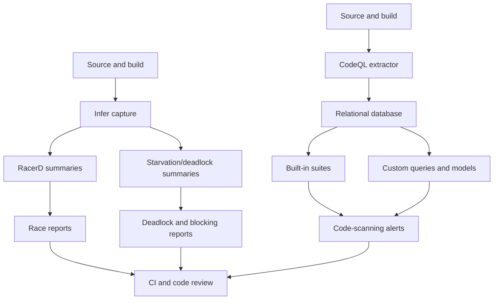

# Infer and CodeQL for Concurrency Bug Analysis

## Executive Summary

Infer and CodeQL are static-analysis ecosystems with different strengths. Infer's RacerD is a specialized, compositional detector for a high-confidence subset of Java data races, while Infer's Starvation and deadlock analyses target lock-order problems, deadlocks, blocking operations, and Android UI-thread misuse. Meta reported more than 1,000 multithreading issues fixed before production during RacerD's first ten months at Facebook, later reporting more than 2,500 fixed issues. A separate compositional deadlock detector was deployed across very large Android codebases and led developers to action more than 200 reports.[^1][^2][^3]

CodeQL is a general semantic query platform. Its built-in concurrency coverage is pattern-oriented rather than a universal happens-before analysis: examples include unsafe publication, double-checked locking, inconsistent synchronization, lock-order inconsistency, unreleased locks, sleeping while holding a lock, TOCTOU races, and C/C++ lock-discipline defects.[^4][^5][^6]

The strongest concrete CodeQL-triggered fix found was a merged `fangfufu/httpdirfs` change that explicitly resolved CodeQL TOCTOU warnings by replacing check-then-use file operations with safer descriptor/operation-based logic.[^7] An academic study used CodeQL to analyze 3.6 million Java classes and reported 3,893 alerts, including five selected alerts submitted as pull requests to Apache Flink, gRPC, and Jib.[^8]

## Architecture Overview

Infer is centered on capture, specialized abstract analysis, and differential code-review feedback. CodeQL extracts a codebase into a queryable database and evaluates selected queries or custom packs. CodeQL results therefore depend on the selected rules and their library models rather than on a universal concurrency engine.[^9][^10]

## Infer

### RacerD

RacerD is a compositional, interprocedural detector for a selected class of Java concurrency bugs. It does not attempt to prove that a program is race-free. The official documentation says analysis is generally triggered by `@ThreadSafe` annotations or synchronization signals and checks conflicting accesses across methods and relevant implementations.[^11]

Documented bug classes include:

- unprotected writes;
- read/write and write/write races;
- interface thread-safety contract violations;
- races through helper methods and callees;
- cases affected by thread confinement, ownership, aliases, and benign functional computations.[^11]

The documented `Dinner` example shows that RacerD follows a public method into a private helper that writes a field. The `Account` example shows a read-modify-write race: concurrent withdrawals can both pass a balance check unless the operation is synchronized or uses an appropriate atomic abstraction.[^11]

RacerD intentionally favors actionable signal over completeness. Its documented limitations include syntactic access-path matching, missed alias-mediated races, ownership assumptions, incomplete handling of weak memory and `volatile`, and inability to check general deadlock, atomicity, or check-then-act correctness.[^14]

### Deployment evidence

Meta reported that RacerD ran for ten months on Facebook's Android codebase, found more than 1,000 multithreading issues fixed before production, and supported the News Feed migration from a single-threaded to a multithreaded model. The stated engineering goals included low false-positive signal, interprocedural analysis, no manual lock-to-field annotations, and roughly 15-minute feedback at million-line scale.[^1]

The OOPSLA RacerD paper later reported more than 2,500 issues fixed by developers after more than a year. These are industrial usefulness and actionability measures, not conventional recall/precision benchmarks.[^2]

### Starvation and deadlock analysis

Infer's Starvation checker covers deadlocks, `@Lockless` violations, Android StrictMode violations, expensive UI-thread operations, and issue types such as `DEADLOCK`, `STARVATION`, `LOCK_ON_UI_THREAD`, `IPC_ON_UI_THREAD`, and `ARBITRARY_CODE_EXECUTION_UNDER_LOCK`.[^12]

The `ThreadDeadlock.java` regression fixture includes safe same-thread cases, opposite lock acquisition orders across UI and worker contexts, explicit thread assertions, and less-certain lock-based cases.[^15]

Meta's separate compositional deadlock detector was deployed on every commit to an Android application family, including codebases with hundreds of millions of lines. Meta reported more than 200 developer-actioned fixes over two years and an approximately 54% report-fix rate.[^3] The associated ASE paper describes per-method lock summaries, critical pairs, modified-code-first analysis, and a target of under 15 minutes for code-review feedback. Formal soundness/completeness claims apply to a restricted abstract language, not unrestricted Java.[^16]

### Modeling

Infer's regression and pull-request history shows that library models are important. A change added models for `javax.crypto.Mac` because it behaves like a mutable container and can race in concurrent use; `init` and `update` were modeled as writes and `doFinal` as a read/write-relevant operation.[^17]

## CodeQL

### Operating model

CodeQL's built-in `default` suite favors high precision; `security-extended` adds broader coverage with somewhat lower precision and severity. A query in the source tree does not necessarily run in every code-scanning configuration; suite membership and configuration matter.[^10]

### Java/Kotlin queries

| Query | Purpose | Main limitation |
|---|---|---|
| `java/safe-publication` | Finds fields in recognized thread-safe classes that are not safely published | Publication heuristic, not a general race proof.[^19] |
| `java/unsafe-double-checked-locking` | Finds non-volatile double-checked locking | Recognizes a specific structure and has narrow exemptions.[^20] |
| `java/unsafe-double-checked-locking-init-order` | Finds initialization side effects after publication | Limited to recognized double-checked initialization.[^21] |
| `java/inconsistent-field-synchronization` | Finds unsynchronized access when most accesses are synchronized | Uses an 80% threshold and is explicitly low precision.[^22] |
| `java/lock-order-inconsistency` | Finds opposite lock orders that may deadlock | Models recognizable synchronized blocks/methods and `ReentrantLock`, not every lock implementation.[^23] |
| `java/unreleased-lock` | Finds paths with more acquisitions than releases | Uses bounded path reasoning and can simplify complex loops.[^24] |
| `java/sleep-with-lock-held` | Finds `Thread.sleep()` while holding a lock | Local control-flow pattern, not arbitrary deadlock analysis.[^25] |
| `java/toctou-race-condition` | Finds recognizable check-then-use races | Targeted TOCTOU heuristic, not general happens-before analysis.[^26] |

### C# queries

The C# pack includes `cs/inconsistent-lock-sequence`, `cs/locked-wait`, `cs/unsafe-double-checked-lock`, `cs/unsynchronized-static-access`, and `cs/unsynchronized-getter`.[^6] These target lock ordering, waiting while holding another lock, unsafe initialization, ordinary collection access, and mismatched property synchronization.

### C/C++ queries

The built-in C/C++ pack contains:

- `cpp/lock-order-cycle`, which builds a lock-successor graph and reports cycles;
- `cpp/twice-locked`, which detects possible repeated locking and is explicitly low precision;
- `cpp/unreleased-lock`, which detects paths where locks may not be released.[^5]

The research found no built-in C/C++ query for general conflicting shared-memory accesses, complete happens-before analysis, acquire/release verification, relaxed-atomic correctness, or comprehensive C++ memory-model checking.[^5]

The separate `github/codeql-coding-standards` repository adds CERT C/C++ rules, including a narrow bit-field race rule, non-reentrant-library-function checks, and mutex lifetime rules. These are standards checks, not a general race detector.[^13]

## Concrete CodeQL Evidence

### `fangfufu/httpdirfs`

Commit [`f911f7cf61382c41a52d358568bdee43d8aea469`](https://github.com/fangfufu/httpdirfs/commit/f911f7cf61382c41a52d358568bdee43d8aea469) explicitly says it:

- eliminated TOCTOU race conditions in `Cache_exist` and `Cache_delete` by calling `unlink` directly and checking `ENOENT`;
- resolved CodeQL TOCTOU warnings in tests by replacing path-based `stat` with descriptor-based `fstat`.

This is strong evidence of CodeQL influencing a concrete concurrency-related fix because the attribution is explicit in both the commit and changelog.[^7]

### Large-scale Java study

“Scalable Thread-Safety Analysis of Java Classes with CodeQL” reports analyzing 3,632,865 Java classes, 1,992 `@ThreadSafe` classes, and 3,893 CodeQL alerts. The authors submitted five selected alerts as pull requests to Apache Flink, gRPC, and Jib; developers responded to all five and one led to a restructuring discussion.[^8]

The study demonstrates that CodeQL can be extended for large-scale thread-safety analysis. Its public HTML version does not provide a complete alert-to-PR mapping, so the five PRs should be cited as study results rather than independently reconstructed fixes.

## Comparison

| Dimension | Infer RacerD/Starvation | CodeQL |
|---|---|---|
| Primary role | Specialized concurrency analysis | General semantic query platform |
| Race coverage | Purpose-built high-confidence subset | Query-specific; no universal built-in race proof |
| Deadlock coverage | Dedicated lock/thread abstractions | Targeted lock-order, unreleased-lock, wait/sleep, and custom patterns |
| Interprocedural reasoning | Built into concurrency summaries | Available through QL predicates and libraries |
| Workflow | Capture, analyze, differential reports | Extract database, run suites/custom packs, publish alerts |
| Customization | Annotations, models, checker configuration | QL queries, libraries, models, packs, and suites |
| Industrial evidence | Meta deployment with 1,000+ and 2,500+ RacerD fixes; 200+ deadlock fixes | Direct TOCTOU fix and large-scale Java study |
| Main limitation | Incomplete by design; annotations and ownership affect recall | Built-in coverage is pattern-based; custom modeling is needed for framework-specific invariants |

No verified peer-reviewed head-to-head evaluation of Infer and CodeQL specifically for concurrency was found. Their public metrics measure different things and should not be compared as a normalized precision/recall benchmark.[^9]

## Practical Conclusions

1. Use Infer when the main problem is Java/Android concurrency at scale and the organization can adopt Infer's annotations and workflow.[^1][^2][^3]
2. Use CodeQL when broad language coverage, GitHub code scanning, repository-specific rules, or custom framework modeling are priorities.[^4][^10]
3. Do not treat either tool as a complete dynamic race detector. Neither observes production schedules.[^10][^14]
4. For general C/C++ data races, supplement static checks with dynamic race detection, stress testing, or specialized memory-model analysis.[^5]
5. Invest in library and framework models: Infer's `Mac` modeling work and CodeQL's custom query/model mechanisms show that concurrency visibility depends heavily on accurate API modeling.[^10][^17]

## Confidence Assessment

**High confidence:** Infer's RacerD and Starvation capabilities; Meta's RacerD and deadlock-detector deployment claims; official CodeQL query IDs and implementations; and the `httpdirfs` CodeQL-attributed fix.[^1][^3][^5][^7][^11][^12]

**Moderate confidence:** The exact identity of the five public pull requests described by the Java CodeQL study, because the study reports repositories and counts but not a complete alert-to-PR mapping.[^8]

**Qualified evidence:** User-reported Infer false negatives and CodeQL-related pull requests that do not explicitly attribute discovery to CodeQL are treated as contextual evidence, not confirmed tool findings.[^7][^18]

## Footnotes

[^1]: [Meta Engineering, “Open-sourcing RacerD: Fast static race detection at scale”](https://engineering.fb.com/2017/10/19/android/open-sourcing-racerd-fast-static-race-detection-at-scale/).
[^2]: [Blackshear, Gorogiannis, O’Hearn, Sergey, “RacerD: Compositional Static Race Detection”](https://doi.org/10.1145/3276514); [UCL copy](https://discovery.ucl.ac.uk/id/eprint/10074292/).
[^3]: [Meta Engineering, “An open source compositional deadlock detector for Android Java”](https://engineering.fb.com/2022/03/08/android/deadlock-detector-for-android-java/).
[^4]: [CodeQL Java/Kotlin built-in queries](https://docs.github.com/en/code-security/reference/code-scanning/codeql/codeql-queries/java-kotlin-built-in-queries).
[^5]: [CodeQL C/C++ `LockOrderCycle.ql`](https://github.com/github/codeql/blob/main/cpp/ql/src/Security/CWE/CWE-764/LockOrderCycle.ql#L1-L44), [`TwiceLocked.ql`](https://github.com/github/codeql/blob/main/cpp/ql/src/Security/CWE/CWE-764/TwiceLocked.ql#L1-L51), and [`UnreleasedLock.ql`](https://github.com/github/codeql/blob/main/cpp/ql/src/Security/CWE/CWE-764/UnreleasedLock.ql#L1-L84).
[^6]: [CodeQL C# concurrency source](https://github.com/github/codeql/tree/main/csharp/ql/src/Concurrency).
[^7]: [fangfufu/httpdirfs commit `f911f7c`](https://github.com/fangfufu/httpdirfs/commit/f911f7cf61382c41a52d358568bdee43d8aea469).
[^8]: [“Scalable Thread-Safety Analysis of Java Classes with CodeQL”](https://arxiv.org/html/2509.02022v1).
[^9]: [Infer CI workflow](https://fbinfer.com/docs/steps-for-ci/); [CodeQL overview](https://codeql.github.com/docs/codeql-overview/about-codeql/).
[^10]: [CodeQL query suites](https://docs.github.com/en/code-security/concepts/code-scanning/codeql/codeql-query-suites); [custom query suites](https://docs.github.com/en/code-security/tutorials/customize-code-scanning/create-query-suites).
[^11]: [Infer RacerD documentation](https://github.com/facebook/infer/blob/main/website/docs/checker-racerd.md).
[^12]: [Infer Starvation documentation](https://github.com/facebook/infer/blob/main/website/docs/checker-starvation.md); [Infer issue types](https://fbinfer.com/docs/all-issue-types/).
[^13]: [CodeQL coding standards CERT rules](https://github.com/github/codeql-coding-standards/tree/main/c/cert/src/rules).
[^14]: [Infer RacerD limitations](https://github.com/facebook/infer/blob/main/website/docs/checker-racerd.md#limitations).
[^15]: [Infer `ThreadDeadlock.java`](https://github.com/facebook/infer/blob/main/infer/tests/codetoanalyze/java/starvation/ThreadDeadlock.java#L14-L99).
[^16]: [Brotherston et al., “A Compositional Deadlock Detector for Android Java”](https://discovery.ucl.ac.uk/id/eprint/10140070/).
[^17]: [facebook/infer pull request #1395](https://github.com/facebook/infer/pull/1395).
[^18]: [Infer `LockSensitivity.java`](https://github.com/facebook/infer/blob/main/infer/tests/codetoanalyze/java/starvation/LockSensitivity.java#L1-L32).
[^19]: [CodeQL `SafePublication.ql`](https://github.com/github/codeql/blob/main/java/ql/src/Likely%20Bugs/Concurrency/SafePublication.ql#L2-L94).
[^20]: [CodeQL `DoubleCheckedLocking.ql`](https://github.com/github/codeql/blob/main/java/ql/src/Likely%20Bugs/Concurrency/DoubleCheckedLocking.ql#L2-L41).
[^21]: [CodeQL `DoubleCheckedLockingWithInitRace.ql`](https://github.com/github/codeql/blob/main/java/ql/src/Likely%20Bugs/Concurrency/DoubleCheckedLockingWithInitRace.ql#L2-L45).
[^22]: [CodeQL `InconsistentAccess.ql`](https://github.com/github/codeql/blob/main/java/ql/src/Likely%20Bugs/Concurrency/InconsistentAccess.ql#L19-L75).
[^23]: [CodeQL `LockOrderInconsistency.ql`](https://github.com/github/codeql/blob/main/java/ql/src/Security/CWE/CWE-833/LockOrderInconsistency.ql#L70-L187).
[^24]: [CodeQL Java `UnreleasedLock.ql`](https://github.com/github/codeql/blob/main/java/ql/src/Likely%20Bugs/Concurrency/UnreleasedLock.ql#L105-L162).
[^25]: [CodeQL `SleepWithLock.ql`](https://github.com/github/codeql/blob/main/java/ql/src/Likely%20Bugs/Concurrency/SleepWithLock.ql#L1-L29).
[^26]: [CodeQL Java TOCTOU query](https://github.com/github/codeql/blob/main/java/ql/src/Security/CWE/CWE-367/TOCTOURace.ql#L35-L127).
