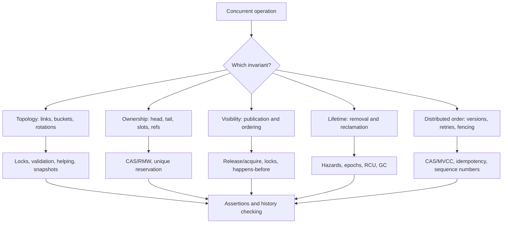

# Concurrency Bugs in Software: A Data-Structure-Centered Guide

## Executive Summary

Concurrency bugs in data structures usually arise when an operation protects one property but not the whole state transition. Common failures include lost updates, duplicate or missing elements, broken pointer topology, stale reads, iterator invalidation, unsafe publication, ABA, and use-after-free during reclamation.

A program can be free of ordinary data races and still be incorrect: atomic fields do not make compound operations atomic, and race detectors do not prove linearizability or invariant preservation. The central design rule is:

> Protect both the representation invariant and the lifetime of every object reachable during an operation.

Coarse-grained locking is often the safest solution. Lock-free designs can improve progress or scalability, but require a complete protocol covering CAS, memory ordering, logical deletion, helping, and memory reclamation.

## 1. Core Concepts

### Data races versus atomicity

A data race is an unordered conflicting access to shared state. In C++, an ordinary data race generally produces undefined behavior; in Java, unsynchronized code remains subject to the Java Memory Model and may observe surprising values or reorderings.[^1][^2]

Preventing data races is necessary but not sufficient. This is still incorrect even when `counter` is atomic:

```cpp
counter.store(counter.load() + 1);
```

Two threads can both load `0` and both store `1`. The increment must use `fetch_add`, a CAS loop, or a lock.

### Linearizability

Linearizability requires every completed operation to appear to take effect at one instantaneous point between invocation and response, producing a legal sequential history while preserving the order of non-overlapping operations.[^3]

It is the standard correctness target for concurrent stacks, queues, sets, maps, and trees.

### Happens-before and publication

An initialized object must be published with an ordering edge, not merely by making its pointer visible. In C++, a release store followed by an acquire load can make prior initialization visible; relaxed atomics provide atomicity for the atomic object but do not provide general ordering for surrounding fields.[^4]

### Progress

- **Blocking:** operations may wait for locks or other threads.
- **Obstruction-free:** an operation completes when it eventually runs alone.
- **Lock-free:** the system as a whole makes progress, although one thread may starve.
- **Wait-free:** every operation completes in a bounded number of its own steps.

A CAS loop may be lock-free while still suffering from ABA, stale publication, starvation, or use-after-free.[^5]

## 2. Failure Taxonomy

| Bug | Data-structure manifestation | Root cause |
|---|---|---|
| Lost update | Two appends use the same index; map updates overwrite one another | Non-atomic read-modify-write |
| Duplicate result | Two consumers pop the same node or message | Ownership transfer is not serialized |
| Missing result | Queue element or list node disappears | Concurrent pointer/index writes overwrite one another |
| Broken topology | Cyclic list, inconsistent tree, disconnected bucket chain | Multi-pointer transition is partially visible |
| Iterator invalidation | Reader follows an element after erase or reallocation | Structural mutation invalidates references |
| Unsafe publication | Reader sees a node before fields are initialized | Missing release/acquire or lock edge |
| ABA | Pointer changes A→B→A and stale CAS succeeds | Bitwise equality is mistaken for unchanged identity |
| Use-after-free | Borrowed pointer survives container unlock | Container protection does not protect object lifetime |
| Torn snapshot | Reader sees new `x` with old `y` | Multi-word invariant has no atomic commit |
| Stale distributed write | Old cache or replica overwrites newer state | Missing versions, CAS, fencing, or causal metadata |

## 3. Structure-Specific Bugs

### Arrays and resizable arrays

A naïve append combines slot reservation, initialization, and length publication:

```text
i = size
data[i] = value
size = size + 1
```

Two producers can select the same index, or a consumer can observe the new length before the element is initialized.

Resize introduces a lifetime race:

```text
Reader:  p = table
Writer:  allocate new buffer, copy, publish, free old buffer
Reader:  dereference p
```

The reader may use freed storage. C++ vector reallocation invalidates iterators, pointers, and references into the old storage.[^6]

**Mitigations:** reserve indexes atomically, publish initialized slots with release/acquire, protect resize with a lock, use immutable snapshots with deferred reclamation, or use a reviewed concurrent vector. Lock-free dynamically resizable arrays exist, but resizing, publication, and reclamation must be designed together.[^7]

### Linked lists

A valid list must remain reachable, acyclic, ordered when required, and safe to traverse while nodes are removed.

```text
A -> B -> C
T1: X.next = B; CAS(A.next, B, X)
T2: mark B;    CAS(A.next, B, C)
```

A correct non-blocking list retries or helps when links change. Harris's algorithm separates logical deletion from physical unlinking.[^8]

The severe race is reclamation:

```text
T1: p = A.next
T2: unlink(B); free(B)
T1: read p->next       // use-after-free
```

Hazard pointers require publishing protection before dereferencing and validating that the source still points to the protected object. Epoch reclamation and RCU defer destruction until readers can no longer hold references.[^5][^9][^10]

### Trees

Binary-search trees must preserve ordering, reachability, balance metadata when applicable, and parent/child agreement.

A rotation is a multi-pointer transition:

```text
        y                 x
       / \               / \
      x   C      ->      A   y
     / \                   / \
    A   B                 B   C
```

If readers observe writes to `y.left`, `x.right`, and `root` at different times, they can miss keys, follow inconsistent parent links, or loop.

**Mitigations:** use a coarse tree lock unless profiling proves it inadequate; use lock coupling with strict lock ordering; publish immutable/path-copied versions and reclaim old roots with epochs/RCU; or adopt a complete non-blocking algorithm. Adding CAS to a sequential tree without a protocol for rotations, helping, and reclamation is unsafe.[^11]

### Hash maps and resizing

A hash map must keep each live key reachable from exactly one valid bucket, publish initialized entries, and preserve all entries across resize.

A lookup can be synchronized while the returned object is not:

```text
lock(table)
p = lookup(key)
unlock(table)
use(p)
```

Another thread can remove and free `p` after unlock. The FreeRDP DRDYNVC advisory documents this exact class of bug: a synchronized hash-table lookup returned a borrowed channel pointer whose lifetime was not protected after the lock was released.[^12]

**Mitigations:** acquire an object reference while holding the table lock, protect the object with a second lock, use RCU or copy-on-write, coordinate migration with versioning, or use a reviewed concurrent map.

### Stacks

A stack's abstract invariant is LIFO order, but `push` and `pop` combine reading the top, accessing a node, and changing ownership.

A Treiber stack commonly uses:

```text
repeat:
    old = head
    node.next = old
until CAS(head, old, node)
```

The successful CAS is typically the push linearization point. The algorithm is still unsafe if `old` can be reclaimed or reused.

Classic ABA:

```text
T1 reads head = A
T2 pops A, pops B, then reuses/reinserts A
T1 CAS(head, A, B) succeeds
```

Hazard pointers, tagged pointers, epochs, RCU, or garbage collection address identity and lifetime; CAS alone does not.[^5]

### Queues and ring buffers

A bounded queue must coordinate head, tail, capacity, and per-slot state. A producer must reserve a unique slot, initialize it, then publish it. A consumer must claim a slot before reading and release it for reuse.

If “not full” and tail advancement are separate, two producers can claim the same slot. If a consumer advances head before reading, a producer can overwrite data still in use. Ring-buffer wraparound requires sequence numbers or generation tags so the same array index can represent different logical generations.

For message queues and logs, at-least-once delivery creates a second invariant: messages may be delivered more than once. Idempotency keys, inbox tables, transactional offset/output, and per-key partitioning are standard mitigations.[^13]

### Heaps and priority queues

A binary heap must preserve heap order and complete-tree array layout. Concurrent `sift-up` and `sift-down` can swap overlapping nodes and leave one branch ordered while another is stale. A concurrent `extract-min` may return a result that is not the minimum of any legal ordering.

**Mitigations:** serialize structural changes with a lock; shard independent priority queues and define a merge policy; use a purpose-built concurrent priority queue; or document a relaxed priority contract. A single atomic root or size field cannot make several swaps one operation.

### Multi-word state and snapshots

If `x` and `y` must change together, two atomic stores are insufficient:

```text
x = new_x
y = new_y
```

A reader can observe old `x` with new `y`. Sequence counters allow readers to copy scalar state and retry if a writer overlaps them, but they are unsuitable when readers follow pointers that writers may invalidate.[^14]

Alternatives include a mutex, immutable versions published by one atomic pointer, a packed atomic representation, or a multi-word CAS protocol.

## 4. Memory Reclamation

Removing an object from a data structure does not prove that no thread still has a pointer to it.

### Hazard pointers

The reader publishes a hazard pointer, rechecks the source, and only then dereferences. Removed objects are retired and reclaimed only after scanning hazards. Publishing after dereferencing is too late.[^5]

### Epoch-based reclamation

Readers pin an epoch before loading a pointer. Removed objects are retired and reclaimed only after all relevant participants have advanced or unpinned. A stalled participant can prevent reclamation indefinitely, creating memory pressure even when logical correctness holds.[^15]

### RCU

RCU readers enter a read-side critical section, load and use an object, then exit. Writers unlink the object and wait for a grace period before freeing it. RCU is effective for read-mostly lists and snapshots, but does not make arbitrary in-place multi-field updates atomic.[^9]

## 5. Language and Library Traps

| Environment | Important rule |
|---|---|
| Java `ArrayList`, `HashMap` | Ordinary collections are not safe for concurrent structural mutation; synchronized wrappers still require synchronization while iterating.[^16] |
| Java `ConcurrentHashMap` | Per-key operations are thread-safe; compound actions should use `compute`, `merge`, or `putIfAbsent`; iterators are weakly consistent.[^17] |
| C++ STL | Concurrent reads are generally allowed under library rules, but structural mutation and iterator-invalidating operations require external synchronization.[^6] |
| Rust | Ownership and borrowing prevent many races statically, but atomics and concurrent containers still require algorithm-level correctness. |
| Go maps | Concurrent map access and iteration/write require synchronization; the race detector only observes executed schedules.[^18] |
| Python | Thread-safety depends on interpreter and operation; do not infer that an implementation detail makes compound protocols atomic. |

Safe publication of a collection is separate from safe mutation after publication.

## 6. Real-World Evidence

- **CVE-2024-36904:** a Linux TCP TIME-WAIT hash-table publication window allowed a socket to become visible before its reference count was safe; the fix prevents incrementing a zero reference count.[^19]
- **CVE-2023-4244:** Linux `nf_tables` set and garbage-collection lifetime management raced; the fix added explicit reference counting, dead-state handling, and coordinated asynchronous GC.[^20]
- **FreeRDP GHSA-6mpx-c8rj-whj5:** a synchronized hash-table lookup returned a borrowed channel pointer that could be freed after the table lock was released.[^12]
- **Dirty Pipe, CVE-2022-0847:** stale pipe-buffer state violated a queue-like representation invariant and enabled writes into read-only page-cache data.[^21]
- **Meta cache consistency:** an older cache fill could arrive after a newer invalidation and overwrite the fresh value; versioning and invariant monitoring address this class of race.[^22]

## 7. Distributed Data Structures

Distributed maps, caches, queues, replicated sets, and lease tables add message delay, retries, partitions, and failover to the same basic problems.

### Maps, counters, and caches

A read-modify-write counter loses updates when two clients read the same value and both write the same incremented result. Use an atomic server-side increment, a transaction/CAS, escrow, or a CRDT counter for commutative increments.[^23]

A stale cache fill can overwrite a newer value. Store a source version and accept a refresh only if its version is at least as new as the current entry. TTL bounds staleness duration but does not guarantee correctness during the TTL interval.[^22][^23]

### Replicated sets

A delayed add can resurrect an item after a remove. Tombstones and causal remove metadata prevent resurrection; safe tombstone collection requires evidence that replicas observed the relevant causal context. Add-wins and remove-wins sets make the conflict policy explicit.[^23]

### Queues and logs

At-least-once delivery means consumers must tolerate duplicates. Ordering is commonly per partition or per key, not global. Sequence numbers, idempotency keys, transactional processing, and inbox tables make retries safe.[^13]

### Lease and lock tables

An expired client may resume after a new owner has acquired the lease. A monotonically increasing fencing token must be checked by the protected resource:

```text
accept(operation) iff operation.token >= stored_token
```

The resource, not the old client, enforces ownership. Redis documentation explicitly warns that a lock alone is insufficient for long-running operations and recommends fencing for this stale-owner problem.[^24]

## 8. Detection and Reproduction

Use several complementary techniques:

1. **Sequential reference model:** define FIFO, LIFO, map, set, or priority semantics.
2. **Executable invariants:** check reachability, acyclicity, size, uniqueness, ordering, retired-node safety, and snapshot consistency.
3. **Stress and schedule fuzzing:** vary operation mixes, keys, contention, delays at CAS/publication/reclamation points, allocator pressure, and seeds.
4. **Race detectors:** ThreadSanitizer detects executed unsynchronized accesses, but not linearizability, lost updates made entirely with atomics, ABA, reclamation correctness, or general deadlocks.[^25] Helgrind is complementary for POSIX synchronization but may need annotations for custom atomics and pools.[^26]
5. **Systematic scheduling/model checking:** tools such as CHESS explore bounded interleavings more systematically than stress tests, at the cost of state explosion and abstraction risk.[^27]
6. **History checking:** record invocation/response histories and check linearizability against the sequential model. This catches lost, duplicate, reordered, and impossible results that race detectors miss.[^28]
7. **Deterministic replay:** preserve seeds, schedules, histories, and inputs; replay tools such as `rr` make the first invariant violation inspectable.[^29]

Practical loop:

```text
stress/fuzz -> capture seed and history -> deterministic replay
-> minimize schedule -> identify invariant/linearization failure
-> add regression test
```

## 9. Review Checklist

For every concurrent data structure, answer:

1. What is the sequential specification?
2. What are the representation invariants?
3. Where is each operation's linearization point?
4. What happens if a thread pauses after loading a pointer but before validation?
5. Can an object be removed while a caller still holds a borrowed pointer?
6. What prevents ABA and premature reclamation?
7. Which release/acquire or lock edges publish initialized state?
8. Are multi-field invariants updated in separate operations?
9. What happens at empty, full, one-element, resize, wraparound, and delete/reinsert transitions?
10. Does the test suite check histories, not just crashes?
11. For distributed state: how are duplicates, reordering, stale writes, partitions, and old owners fenced?

## Architecture Diagram



## Confidence Assessment

High confidence: the distinctions between data races, atomicity, linearizability, memory ordering, progress, iterator invalidation, ABA, and reclamation are supported by standards, foundational papers, official documentation, and cited implementation analyses.

Moderate confidence: exact library behavior can vary by language version and implementation, especially Python interpreter details. The report assumes shared-memory systems with C/C++/Java-like memory models unless the distributed section is explicitly identified.

## Footnotes

[^1]: [MITRE CWE-362](https://cwe.mitre.org/data/definitions/362.html)
[^2]: [Java Language Specification, Chapter 17](https://docs.oracle.com/javase/specs/jls/se25/html/jls-17.html)
[^3]: [Herlihy and Wing, “Linearizability”](https://doi.org/10.1145/78969.78972)
[^4]: [C++ memory order](https://en.cppreference.com/w/cpp/atomic/memory_order)
[^5]: [Michael, “Hazard Pointers”](https://www.cs.otago.ac.nz/cosc440/readings/hazard-pointers.pdf)
[^6]: [cppreference container thread safety](https://en.cppreference.com/w/cpp/container#Thread_safety)
[^7]: [Lock-free Dynamically Resizable Arrays](https://stroustrup.com/lock-free-vector.pdf)
[^8]: [Harris, “A Pragmatic Implementation of Non-Blocking Linked-Lists”](https://www.microsoft.com/en-us/research/publication/a-pragmatic-implementation-of-non-blocking-linked-lists/)
[^9]: [Linux RCU documentation](https://docs.kernel.org/RCU/whatisRCU.html)
[^10]: [Crossbeam epoch implementation](https://github.com/crossbeam-rs/crossbeam/blob/master/crossbeam-epoch/src/lib.rs)
[^11]: [Non-blocking Binary Search Trees](https://doi.org/10.1145/1835698.1835735)
[^12]: [FreeRDP GHSA-6mpx-c8rj-whj5](https://github.com/FreeRDP/FreeRDP/security/advisories/GHSA-6mpx-c8rj-whj5)
[^13]: [Apache Kafka delivery semantics](https://kafka.apache.org/35/design/design/)
[^14]: [Linux sequence counters and seqlocks](https://docs.kernel.org/locking/seqlock.html)
[^15]: [Fraser, Practical Lock-Freedom](https://www.cl.cam.ac.uk/techreports/UCAM-CL-TR-579.pdf)
[^16]: [Java ArrayList API](https://docs.oracle.com/en/java/javase/25/docs/api/java.base/java/util/ArrayList.html)
[^17]: [Java ConcurrentHashMap API](https://docs.oracle.com/en/java/javase/25/docs/api/java.base/java/util/concurrent/ConcurrentHashMap.html)
[^18]: [Go race detector](https://go.dev/doc/articles/race_detector)
[^19]: [Linux fix for CVE-2024-36904](https://git.kernel.org/pub/scm/linux/kernel/git/torvalds/linux.git/commit/?id=f2db7230f73a80dbb179deab78f88a7947f0ab7e)
[^20]: [Linux fix for CVE-2023-4244](https://git.kernel.org/pub/scm/linux/kernel/git/torvalds/linux.git/commit/?id=3e91b0ebd994635df2346353322ac51ce84ce6d8)
[^21]: [Dirty Pipe technical write-up](https://dirtypipe.cm4all.com/)
[^22]: [Meta, cache consistency](https://engineering.fb.com/2022/06/08/core-infra/cache-made-consistent/)
[^23]: [Dynamo: Amazon’s Highly Available Key-value Store](https://www.allthingsdistributed.com/files/amazon-dynamo-sosp2007.pdf)
[^24]: [Redis distributed locks and fencing](https://redis.io/docs/latest/develop/clients/patterns/distributed-locks/)
[^25]: [LLVM ThreadSanitizer](https://clang.llvm.org/docs/ThreadSanitizer.html)
[^26]: [Valgrind Helgrind manual](https://valgrind.org/docs/manual/hg-manual.html)
[^27]: [CHESS systematic testing](https://www.microsoft.com/en-us/research/publication/chess-a-systematic-testing-tool-for-concurrent-software/)
[^28]: [Testing and Verifying Concurrent Objects](https://research.cs.wisc.edu/trans-memory/biblio/bibhtml/wing_verifying-concurrent-objects_jpdc_1993.html)
[^29]: [rr record/replay debugger](https://rr-project.org/)
